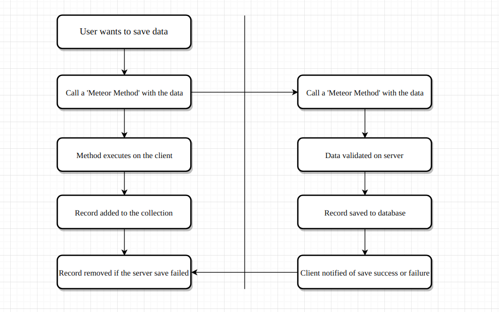

# Meteor Publish/Subscribe & Methods Notes

This is a recopilation of notes that I feel interesting and explanatory

* [Meteor pub/sub doc](https://docs.meteor.com/api/pubsub.html)
* [Meteor methods doc](https://guide.meteor.com/methods.html)

## Meteor publish

A publication is a named API on the server that constructs a set of data to send to a client. A client creates/initiates a subsription which connects to a publication and receives that data.

example of publication (in server):

```javascript
Meteor.publish('customer', function getCustomer(id) {
  check(id, String);
  if (this.userId) {
    return Customers.find({ userId: id });
  }
  return this.ready();
});
```

## Meteor subscribe

A subscription can be tought of as a set of data that changes over time.
The result of this is that a subscription **'bridges'** a server-side **MongoDB** collection and the client-side **Minimongo** cache of that collection.

Subscription is like a pipe that connects a subset of the 'real' connection with the client's version, and constantly keeps it up to date with latest info on the server.

example of subscription (in client):

```javascript
Meteor.subscribe('customer', Meteor.userId());
```

## Meteor methods

* Used to save user inputs events and data that comes from the client.
* Like POST request to your server.
* A method is an API endpoint for your server.
* You can define a Method on the server and its counterpart on the client. Then call it with some data, write to db and get the return value in a callback.

You can declare methods in the server like this

```javascript
import Customers from '../customers';

Meteor.methods({
  'customers.updateCustomer': function updateCustomer(id, data) {
    check(id, String);
    check(data, Object);
    if (_.isEmpty(Customers.findOne({ userId: id }))) {
      return Customers.insert(newData);
    }
    return Customers.update({ userId: id }, { $set: data });
  }
});
```

and then call it in the client with:

```javascript
Meteor.call(
  'customers.updateCustomer',
  Meteor.userId(),
  this.state.customer,
  err => {
    if (err) {
      console.log('Unexpected error has ocurred while updating your profile.');
    } else {
      console.log('Your profile has been updated succesfully');
    }
  }
);
```

### Flow: Saving data in Meteor



Meteor methods are executed both on the client and the server side.
For example, when if we want to store an employee, we should declare a method in the server side:

```javascript
Meteor.methods({
  'employees.insert': function(employee) {
    check(employee, Object);
    Employees.insert({ name: employee.name, age: employee.age });
  }
});
```

and then call the method in the client side:

```javascript
  handleSubmit(event) {
    event.preventDefault();
    Meteor.call('employees.insert', employee);
```

The cool thing there is that Meteor executes the method function in the client side and the server side at the same time.

The client updates instantly and if the server execution fails for some reason the client is notified to revert changes.

## Publish/Subscribe vs Methods

* In pub/sub, as published data gets changed/added the server will automatically send it over to the client subscriptors. That's called reactivity

- Pub/sub is a way to allow access (read & write) to clients and to keep all clients & server updated with latest data.

* Methods is like request/response. You make a request, you get a response. IF data changes you wont know until another call.
* Methods is mucho more, can be user for HTTP calls to Rest API or for fetching data and making some verification on server-side before fetching.

## Loading data with methods

Advantages/disadvantages of loading data in react components with methods instead of using publications.

* Methods can also be used to fetch data instead of publications (but Meteor doc recommends Publication).
* Methods can be useful to fetch the result of a complex computation from the server that doesn't need to update when the server data changes.
* The biggest disadvantage of fetching data through methods is that the data won't be autoloaded into Minimongo so you'll need to manage the lifecycle manually (by using react state).
